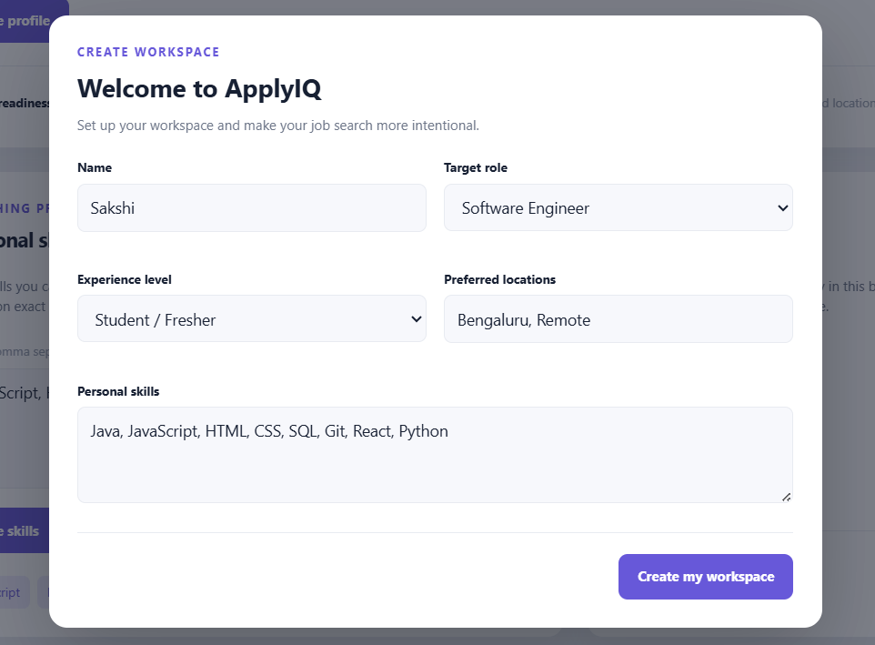
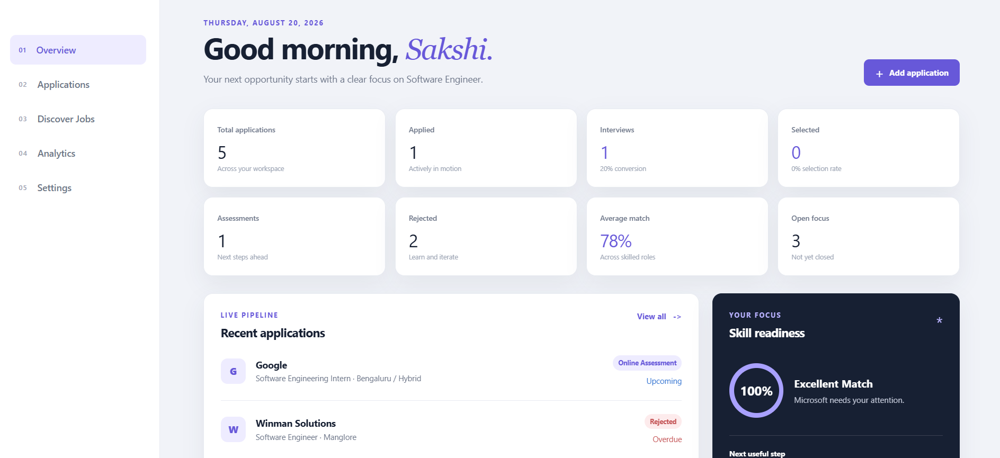
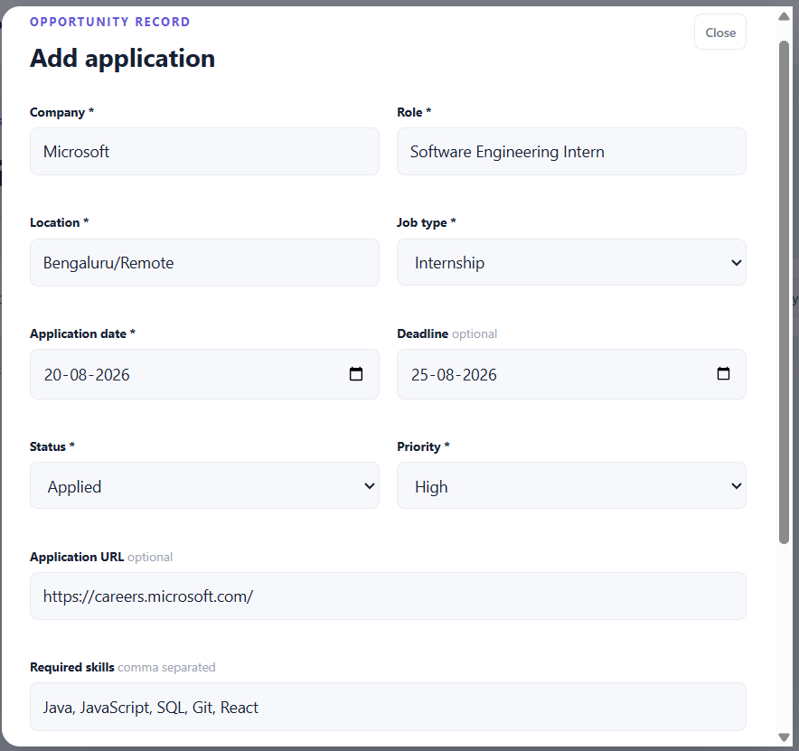
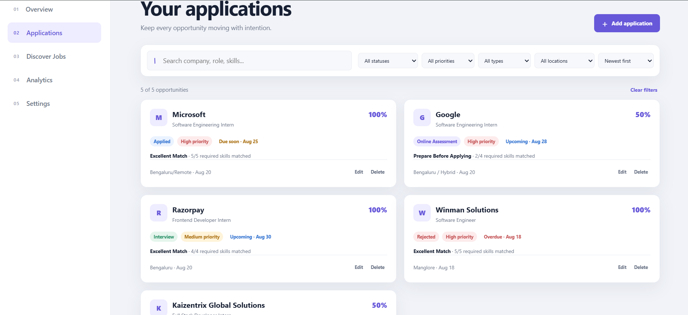
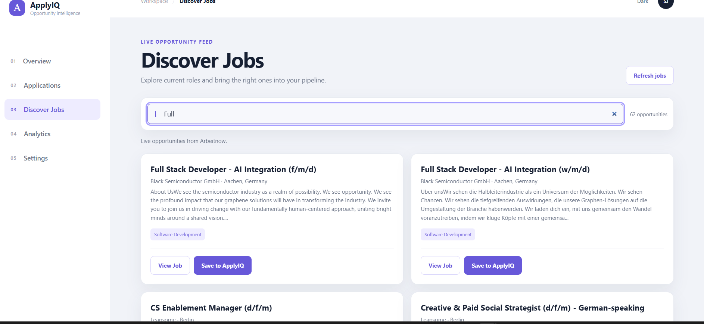
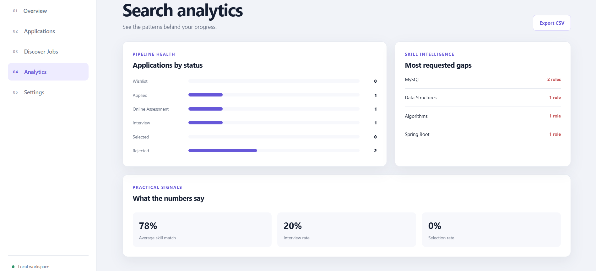
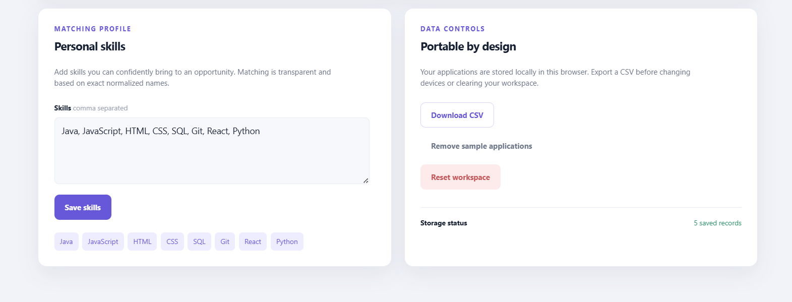

# ApplyIQ

### Smart Job & Internship Opportunity Intelligence Platform

ApplyIQ is a browser-based JavaScript application designed to help students and early-career developers manage their job and internship search in one place.

Instead of simply storing application records, ApplyIQ combines opportunity discovery, skill matching, application tracking, deadline awareness, and analytics to help users make better decisions during their job search.

---

## 📌 Problem Statement

Students applying for internships and entry-level jobs often manage opportunities across multiple websites, spreadsheets, notes, and bookmarks.

This makes it difficult to answer questions such as:

- Which opportunities have I already applied to?
- Which applications need my attention?
- How well do my current skills match a role?
- Which skills am I missing?
- Which applications are approaching their deadlines?
- How is my application pipeline progressing?

ApplyIQ brings these activities together into a single browser-based workspace.

---

## 🎯 Objectives

The main objectives of ApplyIQ are to:

- Organize job and internship applications.
- Discover job opportunities from an external jobs API.
- Compare personal skills with required job skills.
- Identify missing skills for each opportunity.
- Track application progress.
- Highlight upcoming deadlines.
- Provide application analytics.
- Persist user data using browser Local Storage.
- Provide a responsive and accessible interface.
- Apply JavaScript concepts learned throughout the internship to a practical project.

---

# ✨ Key Features

## 1. Personalized Workspace

On the first visit, users can create their personal ApplyIQ workspace.

The profile includes:

- Name
- Target role
- Experience level
- Preferred locations
- Personal skills

The profile is stored locally and used throughout the application.

> **Screenshot:** Add your **Create Workspace / Onboarding** screenshot here.

---

## 2. Personalized Dashboard

The dashboard provides an overview of the user's job search.

It displays:

- Total applications
- Applied applications
- Interviews
- Assessments
- Selected applications
- Rejected applications
- Average skill match
- Open opportunities
- Recent applications
- Skill readiness
- Important next actions

The dashboard is dynamically updated as the user interacts with the application.

> **Screenshot:** Add your **Dashboard** screenshot here.

---

## 3. Application Management

ApplyIQ provides complete CRUD functionality for managing applications.

Users can:

- Create applications
- View applications
- Edit applications
- Delete applications
- Track application status
- Set priority
- Add deadlines
- Add required skills
- Store application URLs
- Add notes

Supported application stages include:

- Wishlist
- Applied
- Online Assessment
- Interview
- Selected
- Rejected

> **Screenshot:** Add your **Applications page with multiple application cards** here.

---

## 4. Search, Filter and Sort

Applications can be searched and organized using multiple controls.

### Search

Users can search by:

- Company
- Role
- Location
- Skills
- Notes

### Filters

Applications can be filtered by:

- Status
- Priority
- Job type
- Location

### Sorting

Applications can be sorted based on available application information such as:

- Newest
- Oldest
- Deadline
- Match score

This allows users to quickly find the opportunities that require attention.

> **Screenshot:** Add your **Applications page showing search/filter/sort controls** here.

---

# 🔎 Discover Jobs

ApplyIQ includes a dedicated **Discover Jobs** section for finding real job opportunities.

Job listings are retrieved using the **Fetch API** from the public Arbeitnow Job Board API.

The application processes the returned JSON data and dynamically displays job cards.

Each job may include:

- Job title
- Company
- Location
- Remote status
- Job type
- Description
- Required tags/skills
- Original job URL

Users can search the retrieved opportunities without making a new API request for every search.

> **Screenshot:** Add your **Discover Jobs page showing live job cards** here.

---

## 🔗 Saving Discovered Jobs

A discovered opportunity can be saved directly into the user's ApplyIQ application tracker.

The flow is:
````text
Discover Job
     ↓
View Opportunity
     ↓
Save to ApplyIQ
     ↓
Application Record
     ↓
Skill Matching
     ↓
Dashboard & Analytics
````

Duplicate protection prevents the same opportunity from being added repeatedly.

> Screenshot: Add a screenshot showing "Save to ApplyIQ" / "Already saved" here.

## 🧠 Skill Matching

One of the main features of ApplyIQ is its rule-based skill matching system.

The user's personal skills are compared with the required skills of an opportunity.

For example:

### User Skills

* JavaScript
* HTML
* CSS
* Git

### Required Skills

* JavaScript
* HTML
* CSS
* React
* Git

The system identifies:

### Matched Skills

* ✓ JavaScript
* ✓ HTML
* ✓ CSS
* ✓ Git

### Missing Skills

* ○ React

A match percentage is then calculated based on the available skill information.

This helps users understand whether they are already prepared for an opportunity or whether they should focus on specific skills first.

> Screenshot: Add your Skill Match / Missing Skills / Readiness screenshot here.

## 📊 Analytics

The Analytics section provides insights into the user's application pipeline.

It includes information such as:

* Application status distribution
* Average skill match
* Interview conversion
* Selection rate
* Skill gaps
* Application trends
* Performance insights

The analytics are calculated from the user's existing application data.

> Screenshot: Add your Analytics page screenshot here.

## ⏰ Deadline Awareness

Applications can contain deadlines and due dates.

ApplyIQ identifies different deadline conditions such as:

* Overdue
* Due soon
* Upcoming

This helps users prioritize applications and assessments that require immediate attention.

> Screenshot: Add your application cards showing deadline indicators here.

## 👤 Profile and Settings

Users can update their profile from the Settings section.

The profile includes:

* Name
* Target role
* Experience level
* Preferred locations
* Personal skills

Changes are immediately reflected throughout the application.

The application also calculates a profile readiness percentage based on the completeness of the user's profile.

> Screenshot: Add your Settings / Profile page screenshot here.

## 💾 Local Data Persistence

ApplyIQ uses the browser's localStorage API to persist application and profile information.

This allows data to remain available after:

* Page refresh
* Navigation
* Closing and reopening the browser

The application uses its existing state structure to manage:

* Profile
* Applications
* Skills
* Preferences

No backend database is required for the current version.

## 📤 CSV Export

Application data can be exported as a CSV file.

The exported data can include information such as:

* Company
* Role
* Location
* Status
* Priority
* Job type
* Application date
* Deadline
* Match score

This allows users to keep an external copy of their application information.

> Screenshot: Add your CSV export result / downloaded spreadsheet screenshot here if you want to demonstrate this feature.

## 🌙 Theme Support

ApplyIQ supports light and dark themes.

The interface is designed to maintain readability and usability across both themes.

## 📱 Responsive Design

The application is responsive and adapts to different screen sizes.

It supports:

* Desktop
* Tablet
* Mobile

The layout includes responsive navigation, forms, cards, grids, and job listings.

> Screenshot: Add one mobile/responsive screenshot here.

## 🛠️ Technology Stack

### Frontend

* HTML5
* CSS3
* Vanilla JavaScript (ES6+)
* Browser APIs
* DOM API
* Local Storage API
* Fetch API

### Data

* JSON
* Arbeitnow Job Board API

### Development

* Git
* GitHub
* VS Code
* Node.js

## 🧩 JavaScript Concepts Applied

ApplyIQ was developed as the final independent project after completing the JavaScript internship tasks.

The project applies the concepts learned throughout the tasks.

| Concept                | Application in ApplyIQ                         |
| ---------------------- | ---------------------------------------------- |
| Variables              | Application and UI state                       |
| Data Types             | Strings, numbers, booleans, arrays and objects |
| Operators              | Statistics and match calculations              |
| Conditional Statements | Validation, deadlines and recommendations      |
| Switch Statement       | Job type normalization                         |
| Loops / Array Methods  | Processing applications, skills and API data   |
| Functions              | Reusable application and UI logic              |
| Arrays                 | Applications, skills and job listings          |
| Strings                | Search and skill normalization                 |
| Objects                | Application and job records                    |
| DOM Manipulation       | Dynamic interface rendering                    |
| Events                 | Forms, buttons, search and navigation          |
| Form Validation        | Application and profile forms                  |
| Callbacks              | Event handlers and array methods               |
| Promises               | Fetch API operations                           |
| Async/Await            | Asynchronous job retrieval                     |
| Fetch API              | Discover Jobs                                  |
| JSON                   | Processing API responses                       |
| CRUD                   | Application management                         |
| Local Storage          | Persistent browser data                        |
| Responsive Design      | Mobile and desktop layouts                     |

## 🔄 Application Architecture

The application follows a client-side architecture.

```text
                    APPLYIQ
                       │
        ┌──────────────┼──────────────┐
        │              │              │
     Profile      Applications    Discover Jobs
        │              │              │
        │         CRUD + Search       │
        │              │              │
        └──────────────┼──────────────┘
                       │
                 Application State
                       │
            ┌──────────┴──────────┐
            │                     │
       Skill Matching        Analytics
            │
            │
       Local Storage
```
The Discover Jobs feature additionally communicates with the external API:

```text
ApplyIQ
   │
   │ Fetch API
   ↓
Arbeitnow Job Board API
   │
   │ JSON
   ↓
Normalize Job Data
   │
   ↓
Render Job Cards
   │
   ↓
Save to ApplyIQ
   │
   ↓
Existing Application State
```

## 📂 Project Structure

```text
ApplyIQ/
│
├── index.html
├── style.css
├── script.js
├── README.md
└── assets/
    └── ...
```

The main application logic is implemented in `script.js`, while the interface structure and styling are handled by `index.html` and `style.css`.

## 📸 Application Screenshots

### 1. User Onboarding

Create a personalized workspace by providing your target role, experience level, preferred locations, and skills.



### 2. Personalized Dashboard

The dashboard provides an overview of applications, interviews, selections, deadlines, skill-match scores, and current focus areas.



### 3. Add Application

ApplyIQ allows users to add opportunities with company, role, location, job type, deadline, status, priority, application URL, and required skills.



### 4. Application Management

Track job and internship opportunities with CRUD operations, search, filtering, sorting, status, priority, deadlines, and required skills.



### 5. Discover Jobs

Discover live job opportunities using the external job API, search available roles, and save relevant opportunities directly to the application tracker.



### 6. Analytics

Analyze application progress, status distribution, skill gaps, average skill match, interview rate, and selection rate.



### 7. Settings & Profile

Manage personal skills, workspace data, and export application information.



## 🚀 Getting Started

### Prerequisites

Install:

* A modern web browser
* Node.js (for development/testing)
* Git

### Clone the Repository

```bash
git clone <YOUR-GITHUB-REPOSITORY-URL>
cd ApplyIQ
```

### Run Locally

Because ApplyIQ is a static web application, it can be served using a simple local server.

For example:

```bash
python -m http.server 8000
```

Then open:

http://localhost:8000

Alternatively, the project can be opened using a suitable VS Code development server.

## 🔌 API Integration

ApplyIQ uses the public Arbeitnow Job Board API to retrieve job opportunities.

### API documentation

https://www.arbeitnow.com/api/job-board-api

The application:

* Sends a Fetch request.
* Waits for the asynchronous response.
* Validates the HTTP response.
* Parses the JSON response.
* Normalizes job information.
* Renders the opportunities dynamically.
* Allows users to save opportunities into ApplyIQ.

Error handling is included so that the core application remains usable if the external API is unavailable.

## 🛡️ Error Handling

The application handles common runtime situations such as:

* Invalid form input
* Missing profile information
* Invalid application data
* Invalid URLs
* Local Storage errors
* Invalid stored JSON
* API request failures
* Empty API responses

When the external jobs API fails, ApplyIQ provides a fallback state instead of making the entire application unusable.

## 🧪 Testing

The project was tested for:

* JavaScript syntax validity
* Profile creation
* Profile persistence
* Dashboard personalization
* Profile editing
* Application CRUD
* Search
* Filtering
* Sorting
* Skill matching
* Analytics
* CSV export
* Discover Jobs
* API data rendering
* Save to ApplyIQ
* Duplicate protection
* API failure fallback
* Local Storage persistence
* Responsive mobile layout

JavaScript syntax was checked using:

```bash
node --check script.js
```

## ⚠️ Current Limitations

The current version is intentionally designed as a client-side JavaScript mini project.

Therefore:

* User data is stored locally in the browser.
* There is no server-side authentication.
* There is no shared database between devices.
* Job discovery depends on the availability of the external API.
* The current API integration retrieves the available job feed rather than maintaining a proprietary job database.

These limitations are intentional for the scope of the project.

## 🔮 Future Enhancements

Possible future improvements include:

* Backend API
* User authentication
* Cloud database
* Cross-device synchronization
* More advanced job recommendation algorithms
* Resume integration
* Automated application reminders
* More job sources
* Advanced skill-gap recommendations
* Application calendar
* Email notifications

## 🎓 Internship Learning Outcome

ApplyIQ was developed as an independent mini project after completing the JavaScript internship tasks.

The project brings together the concepts learned progressively throughout the internship:

```text
JavaScript Fundamentals
        ↓
Conditions & Loops
        ↓
Functions, Arrays, Strings & Objects
        ↓
DOM Manipulation & Events
        ↓
Asynchronous JavaScript & Fetch API
        ↓
CRUD + Local Storage
        ↓
Independent JavaScript Project
        ↓
                    ApplyIQ
```

The project demonstrates how individual JavaScript concepts can be combined to build a practical browser-based application rather than isolated programming exercises.

## 👩‍💻 Author

**Sakshi H C**

Computer Science and Engineering

**Shri Madhwa Vadiraja Institute of Technology and Management**
